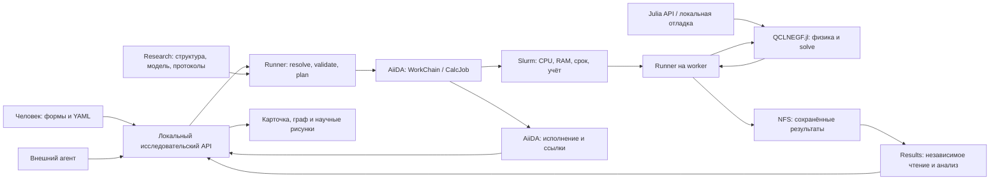
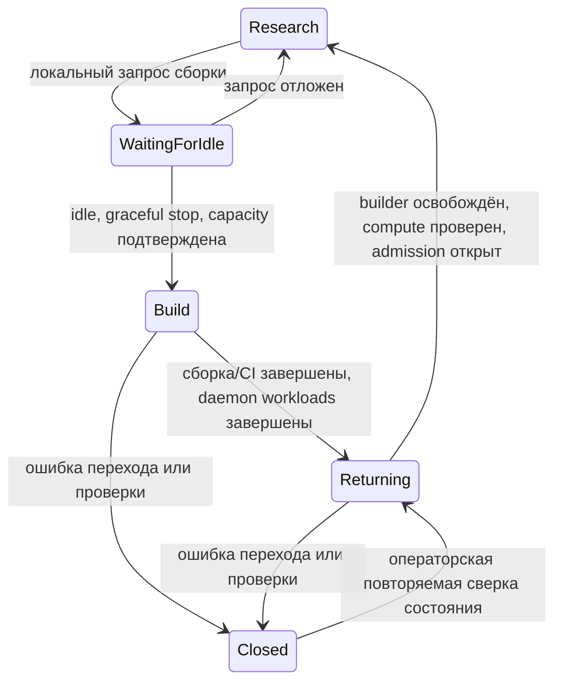

# Предлагаемая архитектура

Статус: предложение из [требований](requirements.md), 2026-10-09.
Решения о масштабе, локальном управлении, независимом Julia API, отдельных
builder/compute VM и первом научном рубеже согласованы. Точные новые форматы
и выбор панели ниже ещё не являются принятыми API или реализованным кодом.

## Система от исследовательского вопроса до результата

Сохраняем специализированное численное ядро и готовые исполнители.
Собственная разработка сосредоточена на QCL постановке, прозрачном разрешении
входов, результатах и интерфейсе исследователя. Единого нового scheduler,
универсального workflow DSL, глобального research cache и серверного LLM
сервиса в архитектуре нет.

Стрелки отражают поток работы/данных, а не обязательные package dependencies.
`QCLNEGF.jl` остаётся обычной Julia библиотекой. Отдельное сохранение выполняет
Runner; интерактивный исследователь вправе вообще не сохранять результат.
HTTP не становится обязательным путём локальной работы.

## Владение и интерфейсы

| Компонент | Владеет | Не должен дублировать |
| --- | --- | --- |
| Core | Физические типы, уравнения, операторы, итерации, проверки одного состояния и их математическая семантика | Файловый каталог, авторизацию, очередь, VM lifecycle |
| Runner | Разрешение предметного запроса в typed inputs; оценку ресурсов; execution unit; persistence/checkpoint; локальный и кластерный CLI | Планировщик jobs, формулы UI, систему VM management |
| Research | Геометрию/материалы, источники, применимость моделей, версии численных протоколов и сценарии исследований | Реализацию операторов и инфраструктурные адреса |
| Contracts | Версионированные межкомпонентные форматы, locator и словарь статусов | Вторую реализацию физической проверки или копии runtime state |
| AiiDA | Персистентное исполнение этапов, attempts, provenance, связь с Slurm и каталог постановок/выводов | Второй вычислительный kernel; идентичную очередь вне Slurm |
| Results | Независимое чтение, выборки, метрики, сравнение и визуализации; исследовательское заключение по объявленному правилу | Новые solves при обычном чтении; повторный численный критерий в browser |
| Portal | Авторизацию HTTP, представление карточки/графа/форм и API для человека/агента | Научные пороги, merge-семантику конфигурации и администрирование гипервизора |
| Platform + private site | NixOS роли, VM/storage/network, учёт Slurm, delivery, resource/lifecycle admission | Научные модельные упрощения ради RAM; private values в public Git |
| Superproject | Совместимый состав gitlinks, интеграционные проверки и единый корпус требований | Runtime service и ручной revision lock |

Восемь репозиториев не нужно немедленно объединять. Их стоимость —
согласованные releases и переносы контрактов. Перед созданием следующего
репозитория проверяем, есть ли независимый потребитель/жизненный цикл. Простое
разбиение большого файла не требует нового пакета или уровня абстракции.

## Конфигурация: небольшой запрос и разрешённая постановка

Логически разделены:

1. **Структура/материалы:** слои, легирование, источники параметров.
2. **Физическая модель:** scattering, embedding/boundary assumptions,
   baths и другие физические приближения.
3. **Численный протокол:** сетки, базис, окна, методы и критерии итераций.
4. **Исследование:** цель, наблюдаемая, условия/оси, независимость или
   продолжение, сравнения и общий бюджет.
5. **Исполнение:** автоматически подобранные CPU/RAM, node class, срок,
   профиль сохранения; без скрытой смены первых трёх объектов.

Это разделение ответственности, а не требование пяти YAML файлов на каждый
run. Обычный ввод — тип задачи, структура/модель, условия, сохранённый
численный протокол и бюджет. Подробности раскрываются по необходимости.
Эксперт может предоставить полный запрос или собрать typed inputs в Julia.

Один resolver Runner обслуживает формы, YAML и CLI. Он проверяет конфликты,
единицы, диапазоны и активные параметры; выдаёт полностью разрешённые inputs
и явный diff от протокола. Derived/default значения видны с источником правила.
Изменение одного authoritative значения не требует синхронизации трёх
температур/напряжений. Сохранённый plan фиксирует смысл задачи; авторский YAML
может оставаться компактным. Порядок файлов не должен быть скрытым правилом
физической модели.

Адаптивность разделяется на три механизма: внутреннюю точность итераций,
дискретизационное уточнение и выбор следующей точки параметров. Их нельзя
объединить одной ручкой «accuracy». COMSOL/CST полезны как примеры организации
Study/Solver/Batch, но не дают готового критерия точности QCL-NEGF.

У material/scattering полей — краткое пояснение и светлая панель
«Модель и источник»: предпосылки, формула/units, used values, раздельное
происхождение модели и конкретных чисел, override и ограничения. Полный
учебник/справка выпускаются из Core/Research/Runner источников как локальная
статика. Нельзя приписывать все значения статье о геометрии или переписывать
формулы в React. [Подробный contract](physics-documentation.md) задаёт
согласованный уровень входа в NEGF и полноту справки.

## Исследование и запуск

Одна карточка содержит цель и актуальную постановку; внутри — явные варианты,
запуски/attempts и анализ. Предлагается стабильный ID карточки и неизменяемая
постановка каждого submission. Это небольшой доменный каталог в существующем
AiiDA/service слое, а не новая обязательная база рядом с AiiDA.

- Независимый sweep создаёт параллельные CalcJobs.
- Continuation создаёт последовательную ветку внутри одного запуска Runner
  с явной передачей accepted initial state. Неудачная точка останавливает
  ветку, её доступное состояние и прежние точки сохраняются для анализа,
  приёмка ветки отмечает ошибку с причиной. Приёмка предшественника для
  numerical initialization и научный вывод исследования обозначены отдельно.
- Карта из выбранного состояния и сравнение — отдельные операции
  постобработки, если они действительно не требуют нового solve.
  Оптические gain/absorption спектры отложены согласно S09; их имеющийся
  экспертный путь не объявляется принятой функцией текущего релиза.
- Уточнение создаёт новый вариант и новые attempts; старые результаты не
  переписываются. Выбор следующего исследования выполняет внешний агент.

Агент сохраняет отдельный файл отчёта, связанный с постановкой, вариантами
и использованными запусками. Авторский вывод и его ограничения доступны
человеку и API; текст отчёта не меняет machine assessments. Дополнительный
обязательный процесс ручного утверждения отчёта не согласован.

Необходимые persistable зависимости исполняет AiiDA WorkChain. Граф portal
выводится из постановки и фактических AiiDA links; планируемая связь не
выдаётся за выполненное действие. WorkGraph можно оценить позднее, если
обычного представления AiiDA links недостаточно. Ручное рисование графа
и динамический универсальный DAG designer не входят в релиз.

Пользователь выбрал существующую гранулярность: независимая точка либо
целая continuation ветка — execution unit Runner, AiiDA управляет
executions/attempts. Внутренние точки видны в графе как этапы этой ветки,
без выдуманных CalcJob links. Per-point CalcJobs не вводятся. До этапа 6
конкретизируется resume и seed-eligibility contract; failed/nonconverged
final, interrupted attempt и missing state имеют разные причины неприёмки.

## Результаты и минимальное происхождение

NFS — единый сохранённый scientific payload; scratch на worker временный.
AiiDA содержит небольшие inputs/status/links и нужные execution records.
Не следует автоматически создавать вторую полную копию HDF5 в AiiDA для
каждого HTTP чтения. Переход к ссылкам на NFS включает явный контракт
retention/доступности: внешний файл не получает гарантий AiiDA repository сам
по себе. Потеря или незавершённая staging отмечается как отсутствие данных.

Рекомендуется использовать уже существующие native commits/recovery Runner,
а в AiiDA retrieve только небольшие metadata и locator. При enabled recovery
Runner уже пишет commits прямо в output storage; не требуется новая система
upload/assimilation. Конкретная adaptation, готовые механизмы и различие
read/derive описаны в [стратегии результатов](results-and-postprocessing.md).

Предлагаемый locator: `research_id / run_id / execution_id / attempt /
calcjob_uuid / artifact / dataset`. Поля, неприменимые локальному solve,
могут отсутствовать явно. Этот locator проходит без потерь от списка до
чтения; server не подменяет попытку «последней» в середине ответа.

API предоставляет:

- **brief:** цель, условия, вариант, наблюдаемые, раздельные статусы,
  вывод/ограничения и ссылки на данные;
- **full:** manifest полного сохранённого профиля и доступ к его данным;
- **slice:** ограниченное чтение dataset с осями/units и идентичностью attempt.

Полный результат не означает обязательное хранение всех промежуточных Green
matrices. Minimal result metadata, scalar iteration history и restart state
имеют разные размеры/назначения. Экспорт архива остаётся для переноса и
восстановления, а не главным интерфейсом исследователя. Existing formats
мигрируются совместимо; удаление download UI не разрешает ломать reader.

Текущий scientific путь уже сохраняет полный **final** state каждой точки,
вернувшей состояние; это не все промежуточные массивы. Этот контракт
сохраняется до отдельного обоснованного изменения output policy. Manifest
различает готовое представление, данные для вычислимой постобработки и
отсутствующие prerequisites. Пример отложенного оптического пути: просмотр
сохранённого spectrum отличается от расчёта на новой photon grid. Второй —
явная bounded derive-команда, при
существенной стоимости через scheduler и тот же CPU grant, без нового SCBA.
GET результата и открытие карты читают готовые данные или ограниченную
выборку. Любая существенная вычислительная постобработка, включая
реконструкцию A(z,E) из полного Green state, запускается явной derive-командой
с бюджетом. В чтении нет скрытого solve или тяжёлой реконструкции.

## Бюджет и права

Предлагается Slurm accounting (`slurmdbd`), `PriorityType=priority/multifactor`
и отдельный QOS grant, связанный с исследованием: `GrpTRESMins=cpu=...`,
`NoDecay`, `UsageFactor=1`, enforcement `safe/qos`. Все attempts используют
одну серверную привязку. `NoDecay` — флаг QOS, не account. Associations
разрешают только принятую QOS привязку; неявный reset/смена grant при retry
запрещены. Точные настройки проверяются на выбранной версии Slurm.
Общий календарный deadline пользователь пока не применяет. Каждый job
имеет конечный wall-time/resource limit, согласованный с CPU grant и
поставленной задачей; это не обещание получить сходимость за сутки.
Согласованная единица CPU-бюджета — выделенные ядра × время выполнения
allocation, включая I/O ожидание и неудачи; фактический CPU показывается
отдельно. Время в очереди не списывается.
Если общий срок будет принят позже, предпочесть передачу `sbatch --deadline`
с конечным time limit всем attempts и серверный запрет новых submissions;
не писать собственный таймер остановки поверх готовой scheduler функции.

При большой concurrency сервер и Slurm должны совместно предотвращать
перерасход; Python счётчик «остатка» без scheduler enforcement недостаточен.
Прогноз CPU/RAM строит Runner по разрешённой задаче и имеющимся измерениям,
с явным запасом. Отсутствие калибровки показывается; physical model не
упрощается ради ресурса. Дополнительные performance агрегаторы не нужны для
базового accounting/admission.

Человек и внешний агент имеют разные credentials, но одинаковые права
исследовательского запуска и единый budget. Инфраструктурные полномочия
выделены оператору. Browser/API не получают Proxmox token, root SSH или
ключ подписи Nix.

## Локальная эксплуатация и передача ресурсов

Согласованы отдельные builder/CI и compute VM. Storage/control — постоянный
малый контур; большие builder и Proxmox compute используют основной ресурс
по очереди после освобождения своих задач. LAN workers могут исполнять
независимые jobs при обычной сборке в пределах общего ресурса. Обновление
релиза — отдельная согласованная whole-cluster остановка по I14.

Диаграмма описывает обычную передачу ресурсов, не режимы физических уравнений
и не обновление кода. Для неё admission/scheduling закрывается только на
затрагиваемом ресурсе; running jobs завершаются, pending jobs ждут.

Порядок обновления пользователь уточнил отдельно:

1. Оператор вручную отменяет верхние QCL AiiDA workflows, включая waiting/
   paused/retry, и все оставшиеся Slurm jobs/queue, затем даёт сигнал доставки.
   Постановки и доступные результаты сохраняются. Одна отмена Slurm jobs
   недостаточна: активный parent WorkChain может создать следующий batch.
2. Доставка закрывает новые submission/scheduling и проверяет, что отмена
   закончена: активные QCL workflows и running/pending jobs отсутствуют.
   Если за это время появился
   новый job, операция остаётся закрытой с объяснением; его отменяет оператор.
   Не требуется автоматический cancellation или перенос очереди между версиями.
   Existing `service.kill_run:275` уже запрашивает отмену workflow/children;
   cancellation асинхронен, подтверждение проверяется на обоих слоях.
3. Остановить все enrolled QCL workers, включая LAN; при необходимости
   допустима принудительная остановка после ограниченного graceful stop.
   Storage/control и посторонние VM не относятся к выключаемому набору.
4. Доставить/активировать один готовый релиз и нужную конфигурацию, запустить
   workers, проверить одинаковый release, NFS/Slurm и basic runtime smoke.
5. Открыть admission после проверки всего принятого worker inventory.
   Новые расчёты запускаются явно под новым релизом.

Rolling updates, многоверсионная совместимость jobs и автоматическая migration
старой очереди не нужны. Ошибка обновления сохраняет общий admission закрытым.
Hard stop не гарантирует последний checkpoint/upload: для анализа остаётся
последнее уже опубликованное состояние; потерянные/неполные данные явно отмечены.

Политика и лимиты — NixOS/systemd, Proxmox CPU weights/VM RAM и Slurm cgroups.
Нужен последовательный переход: desired state сам не гарантирует порядок
drain → idle → graceful stop → reclaim → safe start → health → admission.
Предлагается локальный Ansible playbook со штатными API/modules, одним
сериализованным entry point и наблюдаемым operation state. Community Semaphore
может дать бесплатные кнопку/API/log; платные Workflows не используются.
Его deployment/синхронизация/секреты должны быть включены в проверку, иначе
он лишь заменит оболочку существующего Python.

Для первого научного рубежа достаточно CLI той же операции; UI эксплуатации
может прийти следующим этапом. Не требуется новый постоянный resource-manager
daemon. Если выбранные штатные modules не покрывают атомарные guards, нужен
малый platform adapter с узким контрактом; это открытый engineering риск,
а не обещание «вообще без собственного кода».

Динамическое изменение RAM работающего compute не является базовым путём.
Slurm RealMemory соответствует доказанной capacity активной VM. Посторонним
VM задаются согласованные floors/низкие weights; ballooning помогает, но
не доказывает фактическое освобождение перед стартом большой VM. Swap —
вторичный механизм устойчивости, не бюджет scientific RAM.

GitHub CI ожидает доступного build окна; CI runner не имеет deployment keys.
Готовые release artifacts публикуются локально и развёртываются локальным
операторским механизмом. Недоступность GitHub не мешает эксплуатации уже
подготовленного release. Холодный bootstrap из source может потребовать
GitHub и upstream dependencies; это отдельное условие воспроизводимости.

## Worker, GUI и bootstrap

### Доставка и назначение подписи

Для обычных input-addressed Nix closures сохраняем стандартную trust boundary:
publisher подписывает store metadata, recipient daemon принимает его по
`trusted-public-keys`. Это ответ на «кто вправе поставлять исполняемый код»;
проверка NarHash отвечает за contents. Подпись не доказывает правильность
формул, безвредность скомпрометированного builder или научную приёмку.
Для content-addressed paths Nix использует другой встроенный механизм доверия.
[Nix require-sigs/trusted keys](https://nix.dev/manual/nix/2.34/command-ref/conf-file.html#conf-require-sigs).

Издатель — принятый локальный release процесс; private signing key выдаётся
операторскому service вне CI/scientific users. Получатели — controller/workers
с явно provisioned public key. Проверяется реальный import получателя, а не
только наличие signature поля. Authenticated SSH/TLS для image transfer и
checksum — отдельные границы; дополнительная собственная цепочка detached
подписей каждого scientific файла пока не имеет установленной необходимости.
Такие решения входят в финальный integrity audit, без blanket disabling
защит privileged import.

### Установка и представление

Общая NixOS Linux роль плюс установочные варианты BIOS/UEFI/storage/network
для Proxmox, libvirt и Hyper-V. ISO уменьшает различия гостевых services,
но не устраняет Secure Boot, виртуальные диски, NIC/bridge и host lifecycle.

Доступа к конфигурации LAN DNS нет, поэтому базовый вариант — явный адрес
controller при ручной установке. Worker может использовать DHCP; адрес и
стабильная node identity при trusted enrollment становятся доступными
platform inventory. Изменение адреса требует повторной сверки, а не
отождествления узла с IP. mDNS/Avahi может оповестить локальный сегмент об имени,
но работоспособность multicast/разрешения имён across hosts надо проверить;
на этом не строится обязательный bootstrap путь. Storage/NFS endpoint также
задаётся явно; trusted inventory генерирует нужные hostname mappings и
Slurm NodeAddr. Отсутствие внешнего DNS не требует собственного DNS service,
но нельзя оставить старое NFS имя storage без способа его разрешения.
Жёсткий одинаковый static IP создаёт конфликт при клонировании и не даёт
identity. После первичного доверенного enrollment узел остаётся DRAIN
до проверки release, NFS, cgroups и заявленной capacity. Slurm node config
генерируется из принятого inventory, а не из непроверенного объявления узла.

### GUI состав плана

Рекомендуемый набор — четыре интерфейса. Функции research Portal и
локальной справки входят в согласованный объём; Semaphore Community —
конкретный предлагаемый выбор панели, а не уже установленный компонент.

| Интерфейс | Пользователь / действия | Статус и граница |
| --- | --- | --- |
| Наш React Portal | Исследователь/агент: карточка, постановка, запуск/отмена, граф, итерации, результаты и отчёты | Развивать существующий Portal; специализированный QCL интерфейс, без нового scheduler |
| Proxmox web UI | Оператор: VM, storage/disks, ресурсы и host diagnostics | Сохранить штатную панель; не писать её копию и не приписывать ей scientific acceptance |
| Semaphore Community + Ansible | Оператор: локальные кнопки/API для preflight, ресурсного перехода, доставки готового релиза и onboarding; журналы операций | Рекомендованный кандидат. Одна операция исполняется одним штатным playbook/serial entry point; платные Workflows/remote executors не требуются |
| Локальные Documenter pages | Учебник, полная физическая/API справка, поиск и model/source links рядом с формой | Сохранить existing docs build и публиковать статический release artifact; просмотр без Julia |

Внутри Portal:

- **Исследования:** цель, постановка, варианты, попытки, brief, полные
  сохранённые данные и файл отчёта агента.
- **Конфигуратор:** шаблон и короткая форма, layers/materials/doping с
  профилем структуры, выбранный численный protocol, diff, полный YAML и
  источники effective values. Уровни/волновые функции — отдельная команда
  с бюджетом. Primary S01 — равновесие 0 V / 70 K.
- **Граф:** зависимости и статусы, переход к этапу, запуск и создание
  варианта через формы. Внутренние точки continuation показываются внутри
  одной execution; произвольный DAG editor не нужен.
- **Запуски:** очередь/workflows, причина ожидания/закрытого admission,
  SCBA/Poisson iteration diagnostics, отдельные scientific statuses,
  базовые доступные resource measurements. Missing metric явно неизвестна.
- **Результаты:** ВАХ, populations, potentials/wavefunctions, сохранённые
  spatial-energy maps и сопоставление variants; раздельные read/derive/new
  solve действия по [results contract](results-and-postprocessing.md).
  Оптические gain/absorption spectra отложены по S09.
- **Физика и модели:** контекстная source/model карточка и переход к полному
  учебнику/справке, без дублирования формул в browser implementation.

Для implementation Portal предлагаются готовые MIT компоненты:
[React Flow](https://github.com/xyflow/xyflow) — отображение/навигация графа,
[Plotly.js](https://github.com/plotly/plotly.js) — интерактивные curves/maps,
[Monaco Editor](https://github.com/microsoft/monaco-editor) — полный YAML и
diff. Это библиотеки внутри existing React приложения, не три новых сервиса.
В current `frontend/package.json` их пока нет. Версии и offline assets
выбираются при реализации; semantic validation остаётся у Runner,
подсказки YAML требуют явной schema/help integration. Publication figures
по-прежнему выпускает Results существующим plotting/export путём.

Semaphore templates дают запуск и logs готовых Ansible/OpenTofu действий:
[Task templates](https://semaphoreui.com/docs/user-guide/task-templates).
Workflows в [описании object model](https://semaphoreui.com/docs/introduction/concepts)
отнесены к Pro; на них этот план не зависит. Последовательность tasks одного
template не заменяет общий guard между разными инфраструктурными действиями.
Для LAN операций должны быть локальные ready inputs/artifacts; возможность
работать без обращения к GitHub проверяется на принятой конфигурации.

Отмена перед update выполняется оператором через research/service/AiiDA
путь. GUI показывает «запрошено / подтверждено / остались workflows или
Slurm jobs». Кнопка остановки task в Semaphore не означает отмену научной
очереди. После подтверждения оператор подаёт отдельный сигнал доставки по I14.

Все используемые web страницы принимаются в фиксированной светлой теме,
включая login/dialog/loading/error и сторонние панели. Их defaults могут
выбирать тему ОС: например, это документировано для
[Proxmox GUI](https://www.proxmox.com/en/about/company-details/press-releases/proxmox-virtual-environment-7-4).
Поэтому fixed light — отдельная настройка/проверка, а не свойство названия
продукта. Непроверенная панель пока остаётся кандидатом; auto-dark в release
не допускается по текущему правилу пользователя.

Open OnDemand/WorkGraph/AWX/Cockpit не входят в обязательный набор этого
релиза. Полноценные Grafana/Prometheus aggregators — отдельная задача.
Состояние кластера и доступные job diagnostics показываются без создания
нового telemetry stack. Минимальный S01 не ждёт готовности всех вкладок.

Холодный bootstrap использует source gitlinks и локальный shell-файл с
private inputs. Секреты не попадают в stdout, Git, Nix store/derivation или
общедоступные receipts. Сначала проверка формы inputs/возможностей хоста,
потом cheap preflight, затем builds/VM и runtime gates. Исходный приоритет —
работающий локальный научный цикл S01; детали чистого старта в [rebuild](rebuild.md).
