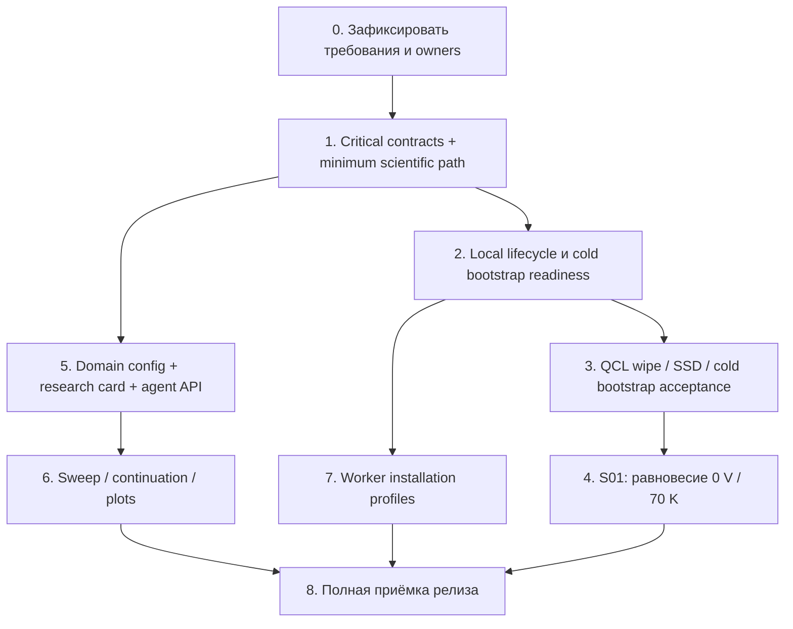

# Порядок рефакторинга и приёмки

Статус: предлагаемый поэтапный roadmap, а не executable implementation
plan. Объём полного релиза согласован; интерфейсы каждого этапа уточняются
перед реализацией. Никакие builds, solver runs и server actions не запущены.

Для новой сессии исполнителя использовать
[точку входа в реализацию](implementation-entrypoint.md): первый read-only
проход, выбор готового ticket этапа 1 и стартовый prompt. Она не заменяет
roadmap вторым планом полного релиза.

## Политика ролей и координации

Это canonical policy пользовательского выбора reasoning effort для работы
по этому корпусу. Сохранять уже выбранную **model**; effort задаёт глубину
работы агента, а не CPU/RAM-бюджет вычислений или право запуска solver.

| Тип работы | Effort | Ответственность |
| --- | --- | --- |
| Текущая координация, аудит, научный и независимый review | `high` | Проверить источники, scope, зависимости и свидетельства; не выдавать согласие агентов за доказательство |
| Исполнение готового задания на код или инфраструктуру | `medium` | Реализовать точный контракт владельца и выполнить порученную bounded проверку |
| Архитектурный design и авторство документации | `ultra` | Разрешить конкретный проектный вопрос, подготовить контракт/brief или owning документ |

Mixed task разделить по типам: coding/infrastructure executor не становится
автором scientific design только из-за соседнего кода. Научный аудит не
переименовывать в code task для выбора меньшего effort. Координатор выдаёт
готовые tickets исполнителям; при неизвестном interface/scientific contract
создаёт конкретный brief соответствующему owner, не ещё одну перепись релиза.

При назначении новых агентов применять effort роли. Для уже работающих
агентов проверить настройки: изменить их через поддерживаемый инструмент
или пересоздать исполнителя с тем же source/ticket и необходимым effort,
если это поддерживается. Если нужный effort недоступен или настройка не
проверяется, явно сообщить ограничение; не подменять уровень молча. Не менять
`~/.codex` config и не заказывать платную/другую model для выполнения policy.
Доступность инструмента не расширяет научные или операторские полномочия.

Параллельно вести независимые задания разных owning components с одним
неизменяемым набором исходников/данных и явными зависимостями. Для одного
файла или ветки назначать одно пишущее задание; вторые агенты могут читать
и рецензировать. У lifecycle операции один владелец и сериализованный
entry point. Число агентов не умножает общий scientific budget: все attempts,
refinements и costly checks списываются из одного порученного бюджета.

Ticket связывает requirement IDs, owner, immutable source, permitted paths,
точное behavior/contract, приёмку и finite budget для соответствующего
дорогого этапа, output contract и exclusions. Независимому первому
рецензенту дать вопрос, предпосылки и первичные артефакты без готового
диагноза; разногласия и самый дешёвый различающий check сохранить.
Готовый ticket исполняется без повторного общего согласования обратимых
действий внутри scope. Вопрос пользователю нужен только там, где недостающий
факт или научное решение действительно меняют зависимую работу; независимые
разрешённые задания продолжаются.

Owning change оформлять component PR, затем обновлять опубликованный gitlink
в root; не объединять весь релиз в огромный PR. Publication scope, новый
runtime experiment, heavy build и server action различать: готовый diff
не разрешает переход к следующему этапу автоматически.

## Два маршрута и один релиз

**Минимальная инфраструктура за сутки** — ориентир пользователя, не оценка
уже доказанной трудоёмкости. Её маршрут: выбранный source → private inputs →
capacity/storage/preflight → холодный build/boot → local submit/status/result/cancel
и чтение малого **synthetic engineering результата**. Это суточный endpoint,
не приёмка S01. Он не включает готовый structure editor, все graph views и
performance aggregators. Если этот маршрут не проходит, фиксируется
конкретный blocker вместо накопления новых features.

**Полный релиз** дополнительно включает короткую конфигурацию, карточку,
agent API, обе ВАХ policies, общий CPU grant, ресурсные переходы, три worker
backend и документацию. Частичные этапы полезны и принимаются независимо;
science milestone не откладывается до завершения этой совокупности.

Этапы 2–3 можно ограничить необходимым минимумом для S01. Если доступен
уже проверенный локальный runtime, отдельно обозначенное exploratory
исследование допускается раньше clean rebuild; оно имеет собственную source/
runtime identity и не является cold-start приёмкой нового состава. Его старые
state/depot/results не переносятся через wipe. Не создавать ложную зависимость
physics → все installer/GUI. После завершения S01 физическая модель не
объявляется навсегда validated для всех новых сценариев.

## Этапы и владельцы

| Этап | Изменения / владелец | Условие выхода | Покрытие |
| --- | --- | --- | --- |
| 0 | Root: принять corpus, владельцев, exclusions, source authority; open решения перечислить явно | Один нормативный индекс; baseline audit отделён от target | D01–D03 |
| 1 | Portal/AiiDA/contracts: CR01 exact attempt locator; platform: CR02–CR05 lifecycle/identity/time/profile; core/Runner: status contract CR06 и прозрачный origin CR07 | Targeted small failure tests подтверждают исправление; compatibility описана; полные numerical builds только при необходимости/бюджете | R03, I10–I12; CR01–CR07 |
| 2 | Platform: локальный serial entry point, private inputs/preflight, обычный VM handoff и whole-cluster update после ручной отмены; устранить GitHub deploy credentials | Все workers остановлены при обновлении, один проверенный релиз до открытия admission; resources по measured reserve; нет hidden oldstate dependency | I01–I05, I10–I14, D07–D08 |
| 3 | Platform/private site: exact teardown plan, SSD/100GB/swap decision, wipe всех QCLowned ресурсов, cold bootstrap из свежего clone | Foreign VM сохранны; QCL остатков нет; lifecycle/synthetic smoke приняты; CI в согласованном build окне этого source-кандидата | D04–D06, I11 |
| 4 | Research/core/Runner/results: равновесие 0 V / 70 K, FD/FDR oracle, raw map/Poisson и различающие refinements | S01 подтверждён либо явно не достигнут с причиной; совпадение seed с Fermi не выдаётся за решение; далее отдельная ненулевая transport point | S01, S07, C01–C02, R09 |
| 5 | Research/Runner/contracts: domain request/protocol resolver; AiiDA/service: карточка/CPU grant; portal: forms/YAML/structure preview/brief/full/slices, model/source help, файл отчёта агента и разные credentials | UI/YAML/API дают одинаковый смысл; агент получает saved manifest и model help; unknown/overrides показаны; concurrent submissions в общем grant; отчёт связан с вопросом/запусками | C03–C13, R01–R05, R07–R12, I06 |
| 6 | Runner/AiiDA/results/portal: independent sweep, continuation failure branch, separate comparisons, graph и QCL transport plot templates | Оба явных пути ВАХ; failure не подставляет seed; disconnected external agent не останавливает jobs; оптические спектры не включены | S02–S06, S08–S09, R02, R06 |
| 7 | Platform: Proxmox/libvirt/Hyper-V install profiles, explicit controller address, trusted node enrollment и release/capacity checks | По одной принятой установке каждого требуемого backend; новый узел DRAIN до проверки; stale/duplicate identity отклоняется | I07–I08 |
| 8 | Root/all owners: integration, current docs, least necessary integrity checks, rebuild/recovery/service/science status matrix | Каждый requirement имеет evidence/unknown/decision; CI final ready ref выполняется в build окне; если ref не менялся, dispatch не повторяется; scope не преувеличен | Все, включая I09/R09/D01 |

CR02–CR05 относятся к безопасной эксплуатации и должны быть закрыты до
production переходов. CR01 обязателен до доверенного использования нового
result API. Независимая локальная point не зависит от legacy approximate
continuation; её можно готовить параллельно, не ожидая уборки всех режимов.

Приоритет S01 не означает запрет параллельной работы над domain/API на
малых fixtures после согласования контрактов. Если S01 обнаруживает
physical defect, расширение автоматического массового запуска этой модели
ждёт его разбора. Первая S01 использует существующий Results/CLI; новый
agent API принимается позднее на том же сохранённом результате.

Final CI относится к конкретному ready source набору и выполняется в его
build окне. Поздние component changes образуют новый кандидат: для него
нужна своя приёмка в новом idle-bound build окне, а не автоматический rerun
старого ref. Обычный ресурсный переход ради CI ждёт завершения S01;
явное обновление следует I14: оператор предварительно отменяет все задания.
Если scientific core/model изменились, отдельно пересмотреть применимость
свидетельств S01; изменение portal CSS само не доказывает и не опровергает
старый научный результат, но новый root не наследует full release acceptance.

## Решения перед соответствующими этапами

Проверка 2026-10-09 не обнаружила необходимости ещё одной общей переписи
архитектуры. Она выявила контракты, которые нельзя оставлять двусмысленными
при реализации их владельца. Это не общий запрет начинать адресные fixes
этапа 1 и не требование завершить все исследования заранее.

Пользователь уточнил: CPU grant считает выделенные ядра × время выполнения,
фактический CPU — отдельная метрика; агент сохраняет файл отчёта; оптические
gain/absorption спектры отложены до отдельного обоснования количественного
отклика. Последнее устраняет обещание accepted optics до scientific audit.
Первым S01 выбран 0 V / 70 K; continuation остаётся внутри одного запуска.
При обновлении оператор вручную отменяет всю очередь/задания и сигналит
доставку, все workers останавливаются, hard stop допустим. Старый вариант
ожидания LAN jobs и migration pending между релизами исключён.
CR08 и DOC02 остаются в review существующего кода, но не задерживают S01
и закрываются до возврата оптического пути в поддерживаемую область.

| Когда | Нерешённый контракт / контрпример | Рекомендуемое разрешение |
| --- | --- | --- |
| До S01 | Oracle и physical set должны соответствовать 0 V / 70 K; Fermi seed или нулевой J сами не доказывают решённое равновесие | Brief фиксирует thermal baths, μ/нейтральность, raw/FDR checks и sensitivity с основанием. Boltzmann только при проверенном dilute limit; численные критерии/бюджет ещё устанавливаются, validation отдельна |
| До первого resource admission | После cold start нет RSS calibration; оптимистичный прогноз может дать OOM | Пользователь отложил точный выбор до реализации/обследования диска. До запуска определить bound/reserves/confidence и finite budget; нехватка capacity даёт wait/reject, не автоматическое уменьшение модели |
| До resource transitions | Lifecycle executor может находиться на выключаемом builder и исчезнуть посреди перехода | Первый install инициируется trusted локальной Linux средой; daily operation исполняется постоянным control-контуром. CLI/GUI используют одного owner и durable operation state; обрыв клиента не открывает admission |
| Перед сигналом доставки | Верхние AiiDA workflows/retries и Slurm jobs/queue отменяются оператором; один scancel не останавливает parent WorkChain | Доставка закрывает submission, проверяет завершённую отмену обоих слоёв, останавливает все QCL workers, активирует один релиз и открывает admission после общего health check. Использовать existing kill_run; при новых jobs до закрытия gate — отказ до повторной ручной отмены; ни rolling, ни multiversion queue migration |
| До большого builder/compute старта | Configured minimum foreign VM не доказывает безопасный live reclaim; VM может остаться active с OOM внутри | Свежий inventory и консервативный reserve; до ограниченной проверки не считать allocation−floor свободной QCL RAM. Swap/ballooning не заменяют доказанную capacity |
| До domain resolver/API | Новый protocol меняет смысл старого короткого YAML; произвольный Julia callback не сериализуется как обычный JSON | Submission фиксирует resolved inputs, protocol version и overrides; обновление создаёт новый вариант с diff. Expert callbacks/operators остаются в локальном Julia API, remote путь принимает объявленные serializable inputs |
| До NFS result API | Brief объявляет completed до публикации payload, либо retry перезаписывает тот же файл | Использовать existing Runner commits/recovery; AiiDA retrieve малые metadata и external locator. Results читает опубликованную generation на NFS, missing данные явны. Конкретная стратегия и read/derive: [results contract](results-and-postprocessing.md) |
| До sweep/continuation | Ошибка приёмки ветки не должна стирать предыдущие точки или превращать missing state в physics failure | Ветка внутри одного запуска — согласовано. Failure сохраняет доступные данные, останавливает ветку и отмечает ошибку/причину; numerical change создаёт variant, recovery resume не меняет постановку. Seed eligibility отличается от discretization/validation всей кампании |

Текущий выбранный путь уже задаёт ветку в `planning.jl:271` и
`workflow.py:111`. На малом synthetic fixture проверить pause/failure/resume
и доступность №1–3 после отказа №4, без дорогого физического расчёта.
Per-point scheduling в реализацию этого релиза не включается.

Read-only inventory до дисковых действий должен установить точную
принадлежность QCL/foreign ресурсов, что означает том «100 ГБ», storage
topology/free extents/SSD health, реальные reserves и доступность seed/
source/gitlinks. Это измеряемые факты по [rebuild](rebuild.md), а не вопросы
для выбора пользователем наугад. Панель GUI, размер swap, точные worker
enrollment adapters и формат полной учебной навигации не блокируют этап 1;
они закрываются перед собственными этапами.

## Конкретные направления рефакторинга

| Owning component | Участки существующего кода | Граница изменения |
| --- | --- | --- |
| Runner | `infrastructure/config/configuration.jl`, `configuration_sources.jl`, `infrastructure/scientific/definitions.jl` | Resolution/typed construction/defaults и source explanations; не менять физическую модель одновременно со структурной перестановкой |
| Core + contracts + Runner | `domain/research_policy.jl`, `composition/scientific_execution.jl`, status schemas | Одна семантика stopping/quality/eligibility; сначала таблица существующих behavior, затем удаление ненужных policies |
| Runner + results | `composition/configured_study.jl`, result comparison APIs | Создание вычислительных variants отдельно от read-only analysis; deprecated wrapper с явным предупреждением о compute |
| AiiDA + portal + contracts | `service.py`, `api.py`, frontend API models | Точный attempt locator; domain study inputs; бюджет; bounded result reads; не помещать numerical критерии в FastAPI |
| Platform | `application_release.py`, `worker_lifecycle.py`, `bootstrap_build.py`, `bootstrap_profile.py` | Один lifecycle owner, desired/observed state и bounded command adapter; удалить дубли после переноса контрактов в стандартные modules |
| Platform | `tofu/proxmox`, `nix/images.nix`, `modules/image.nix`, worker docs | Public backend adapters отдельно от portable guest role; installation profiles отдельно от application release |
| Portal | `frontend/src/main.tsx`, archive/export screens | Разбить по пользовательским действиям; убрать archive-first daily путь; фиксированная светлая тема; небольшой domain configurator вместо schema-form на 200 полей |
| Root + docs owners | `docs/architecture.md`, deployment runbooks, component README/API docs, historical plans | Ссылки на current spec; реальные procedures/version prerequisites; session evidence отдельно |
| Core + Research | Theory/models/atlas, `reference_parameters`, material/scattering passports | Tutorial-first маршрут, полная справка, первичные источники значений; устранить docs/code scope mismatches |
| Contracts + Runner + Portal | Parameter/model bindings, resolved origin, контекстная карточка | Различать formula origin/value origin/file origin; human/agent help из одного источника, без нового evidence ledger |
| Root + Platform + Portal | Locked Documenter build, release packaging, local `/docs/` static serving | Версионно совместимые Core/Runner docs, локальные math/fonts/search, фиксированный light; viewing без Julia |

Не объединять эти изменения в один огромный PR. Component PR включает
contract/migration и проверку конкретного поведения; root gitlink обновляется
после публикации. Изменение source ref не наследует весь старый acceptance.

## Финализация: evidence и SHA без нового global cache

Это отдельно обещанный пользователю аудит **всех компонентов**, а не только
физики. Для каждого сохранения/проверки указать объект, назначение, момент,
стоимость, trust boundary и реакцию на failure. Сохранять нужную integrity,
устранять дубли, не пересчитывать payload при каждом brief/catalog query.

- Native checkpoint `save_checkpoint` использует atomic replacement; его
  поведение не приравнивать к bundle export.
- Bundle commit/verify paths повторно хешируют physics payload; source-level
  число вызовов не равно measured physical reads. Стоимость пока неизвестна.
- Results `StateReader` full-owner verification при открытии не должна стать
  запросом на каждый элемент каталога; brief берётся из небольших metadata.
- Nix cache signature, image transfer checksum, file integrity, archive closure
  и научный verdict — разные проверки. Сохранить только назначенные границы.
- Большие iteration arrays, restart state и interpretation metadata разделить
  по профилям вывода; не требовать общего результата из global cache.
- `TODO.md` RO-Crate — optional portable export backlog, не mandatory daily
  исследовательский путь и не основание копировать весь evidence в каждую карточку.

## Приёмка и остановка разработки

Для C11–C13/D09–D11 — отдельный небольшой срез IFR/screening/LO/material
параметров 70 K, затем coverage всех активных properties. Tutorial/full docs
и source cards проверяются по [документационному contract](physics-documentation.md).
Это не новая prerequisites-цепочка перед S01: для первой точки нужны
объяснимая модель и используемые inputs, а не завершённый весь учебник.

Сначала targeted checks failure contracts, затем минимальный integration
на совместимом составе. Не повторять полные suites без новых изменений или
неразрешённого failure. Schema/eval не заменяет boot; boot не заменяет Slurm
job; job success не заменяет физику; integrity не заменяет scientific verdict.

Если новая работа не закрывает requirement или найденный failure, она
возвращается в backlog. Если новый domain слой требует второй provenance
DB, второй scheduler или универсального DSL, решение пересматривается до
реализации. Большой codebase поддерживается ограниченными публичными
контрактами, не увеличением числа обязательных документов каждого run.

Общий deadline исследования пока отложен. Суточный ориентир относится к
настройке минимальной инфраструктуры. Для будущих вычислений всё равно
нужны конечные CPU/RAM/wall/output budgets; время сходимости не обещано.
